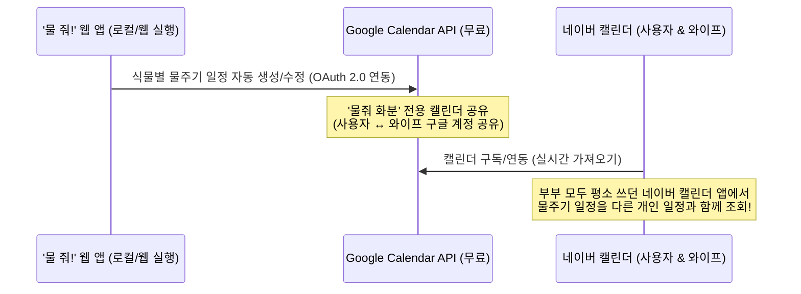

# '물 줘!' 식물 물주기 관리 및 캘린더 연동 서비스 기획/구현 계획서 (최종 승인)

본 계획서는 사용자가 요청하신 **식물 물주기 관리 및 네이버 캘린더 연동 프로그램 '물 줘!'**의 최종 기획서로, 사용자의 피드백(기기 이동 및 이식성 확보 요구)을 전적으로 반영하여 완성되었습니다.

> 현재 구현 안정화 메모 (2026-06-01): 식물 등록/수정/백업 기능은 로컬 파일 더블클릭 실행에서도 사용할 수 있습니다. 다만 Google OAuth 연동은 `file://` 주소가 아니라 `localhost`, GitHub Pages, Vercel 같은 웹 실행 주소에서 사용하는 것을 기준으로 안정화했습니다. 구글 캘린더는 실시간 데이터베이스가 아니라 캘린더 이벤트를 통한 백업/공유 수단이므로, 중요한 변경 후에는 앱의 JSON 백업도 함께 보관하는 것을 권장합니다.

---

## 1. 구현가능성 및 핵심 제약사항 분석

사용자께서 요청하신 핵심 기능은 **"내가 등록한 식물의 물주기 일정을 네이버 캘린더에 자동으로 등록하고, 이를 와이프와 공유하여 함께 확인하는 것"**입니다. 이에 대한 기술적 타당성 분석 결과는 다음과 같습니다.

### ⚠️ 핵심 제한사항: 네이버 개인 캘린더 API 공식 지원 종료
*   **현황**: 네이버는 과거에 제공하던 일반 사용자용 **개인 캘린더 오픈 API 서비스를 공식적으로 종료**했습니다. 현재는 기업용 서비스인 네이버웍스(NAVER WORKS)를 통한 캘린더 API만 공식 제공하고 있습니다.
*   **크롤링 방식의 위험성**: 사용자의 네이버 아이디와 비밀번호를 입력받아 Puppeteer/Selenium 등으로 네이버 캘린더 웹에 자동 로그인하여 일정을 등록하는 크롤링 방식은 보안상 위험하고, 네이버 로그인 보안 강화(2단계 인증 등)로 인해 작동하지 않습니다.

---

## 2. 최선의 우회 해결 방안 제안 (무료 및 공유 가능 전제)

네이버 캘린더 API의 한계를 극복하고, **100% 무료이면서 부부가 함께 실시간으로 공유하고 평소 사용하는 네이버 캘린더에서 볼 수 있도록** 다음과 같은 아키텍처를 도입합니다.

### 💡 최종 아키텍처: Google Calendar API 연동 + 네이버 캘린더 구독/가져오기

구글 캘린더는 완전한 무료 오픈 API(Google Calendar API)를 신뢰성 있게 제공합니다. 이 구글 캘린더를 매개체로 활용하여 네이버 캘린더와 실시간 동기화를 구축합니다.

#### 연동 프로세스
1.  **구글 캘린더 연동**: 사용자는 본 프로그램에서 구글 계정으로 로그인(OAuth 2.0)하고, 프로그램은 구글 캘린더 내에 `'물 줘! 식물 관리'`라는 전용 캘린더를 생성합니다.
2.  **부부 간 구글 캘린더 공유**: 구글 캘린더 설정에서 와이프의 구글 계정을 추가하여 해당 캘린더를 공유합니다. (읽기/쓰기 권한 부여 가능)
3.  **네이버 캘린더에서 불러오기 (최종 목적지)**:
    *   네이버 캘린더 웹/앱 설정에서 **[외부 캘린더 가져오기 -> Google 캘린더 연동]**을 선택하고 본인의 구글 계정을 로그인합니다.
    *   와이프분 역시 네이버 캘린더 앱에서 공유받은 구글 캘린더를 연동합니다.
    *   이렇게 설정하면, 프로그램이 일정을 추가할 때마다 **사용자와 와이프 모두의 네이버 캘린더 앱에 물주기 일정이 실시간으로 완벽하게 동기화되어 노출**됩니다.

---

## 3. 기기 및 위치 이동성(Portability) 보장 방안 (사용자 검토 반영)

회사 PC와 집 노트북, 모바일 스마트폰 등 다양한 환경에서 프로그램의 설치 및 데이터 이동을 완벽하게 지원하기 위해 하이브리드 포터빌리티 아키텍처를 적용합니다.

### 💾 기기 간 데이터 백업 & 복원 (Export & Import) 기능
*   **LocalStorage 기반 오프라인 저장**: 브라우저의 안전한 로컬 저장소(`localStorage`)에 사용자가 설정한 식물 목록과 정보를 저장합니다. 서버 비용이나 개인 정보 유출의 염려가 전혀 없습니다.
*   **JSON 파일 기반 백업/복구**:
    *   **내보내기**: 회사 PC에서 프로그램 내 [데이터 백업]을 클릭하면 현재 등록된 모든 화분 리스트가 포함된 `water_me_data.json` 파일이 다운로드됩니다.
    *   **가져오기**: 집 노트북에서 프로그램을 열고 해당 JSON 파일을 선택하면 1초 만에 데이터가 완벽하게 복원됩니다.

### 🌐 초경량 무설치 정적 웹앱 디자인 (Zero-Dependency)
*   **더블클릭 실행**: 번거로운 개발 패키지(`Node.js`, `npm`) 설치를 배제하고, 순수 HTML5, CSS3, ES6+ Javascript로만 작성된 단독 실행형 정적 웹페이지로 개발합니다.
*   **쉬운 웹 호스팅 배포 지원**: 사용자가 원할 시, 무료 정적 호스팅 서비스(GitHub Pages, Vercel 등)에 한 번만 업로드하여 기기 이동 없이 고유한 웹 주소(URL)로 회사, 집, 모바일에서 동일하게 접속하여 사용할 수 있도록 배포 가이드를 함께 제공합니다.

---

## 4. 프로그램 상세 기능 및 UI/UX 기획

### 🌟 주요 기능 목록
1.  **화분(식물) 등록 및 대시보드**
    *   식물 이미지/아이콘 선택, 식물 이름, 애칭, 최근 물준 날짜, 물주기 주기 설정.
    *   **식물 물주기 주기 검색 (하이브리드)**:
        *   *내장 식물 도감*: 실내 인기 식물 30여 종(몬스테라, 스투키, 산세베리아 등)의 표준 물주기 주기와 팁 내장.
        *   *인터넷 검색 연동*: 도감에 없는 식물의 경우, 입력된 식물명을 바탕으로 **네이버 검색/구글 검색으로 즉시 연결되는 스마트 링크** 동적 제공.
2.  **스마트 물주기 스케줄러**
    *   최근 물준 날짜 + 물주기 주기로 다음 물줄 날짜 실시간 계산.
    *   대시보드 내 "물 줬어요! 💧" 원클릭 갱신 처리.
3.  **구글 캘린더 연동 및 동기화 패널**
    *   OAuth 2.0 기반 구글 로그인 세션 유지.
    *   캘린더 일정(반복 일정 포함) 등록/수정/삭제.
    *   네이버 캘린더 연동 가이드 문서 내장.

### 🎨 디자인 및 Aesthetics (WOW 포인트)
*   **Nature Dark & Glassmorphism 테마**:
    *   초록색과 푸른색 네온 그라데이션, 부드러운 유광 유리판 효과(Glassmorphism)와 입체감 있는 UI.
*   **식물 상태 비주얼 피드백**:
    *   *물 충분함*: 청량한 블루/그린 네온 및 촉촉한 물방울 애니메이션.
    *   *물 필요함*: 카드 테두리가 점차 건조한 오렌지/브라운 톤으로 전환되며 알림 메시지 깜빡임.

---

## 5. 최종 구현 사양 및 워크스페이스 제안

*   **프로젝트 디렉토리**: `D:\Users\vmfort\.gemini\antigravity\scratch\water-me`
*   **적용 기술 스택**: 
    *   **Front-end**: Modern HTML5, ES6+ Javascript (로컬 및 웹 어디서든 무설치 실행 가능한 무의존성 구조)
    *   **Styling**: Pure CSS3 (Flexbox/Grid, Glassmorphism, Premium Keyframe Animations)
    *   **External API**: Google Calendar API & Google OAuth 2.0 Client JS SDK
*   **사용자 권장 사항**: 본격적인 개발 착수를 위해 본 경로를 활성 워크스페이스로 설정해 주시면 즉각적인 테스트와 유기적 작업이 수월해집니다.
